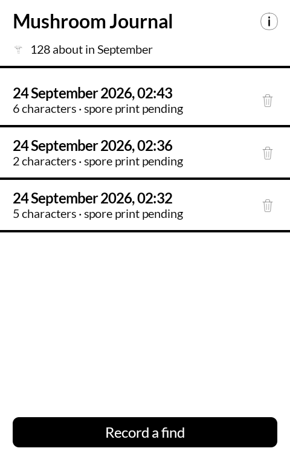
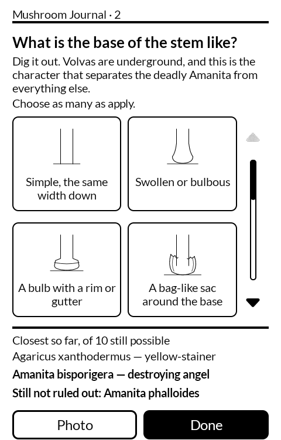
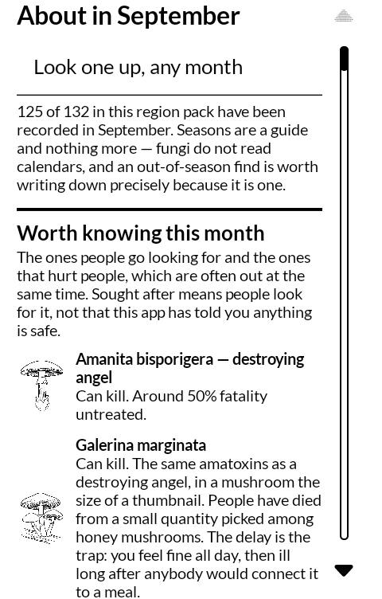
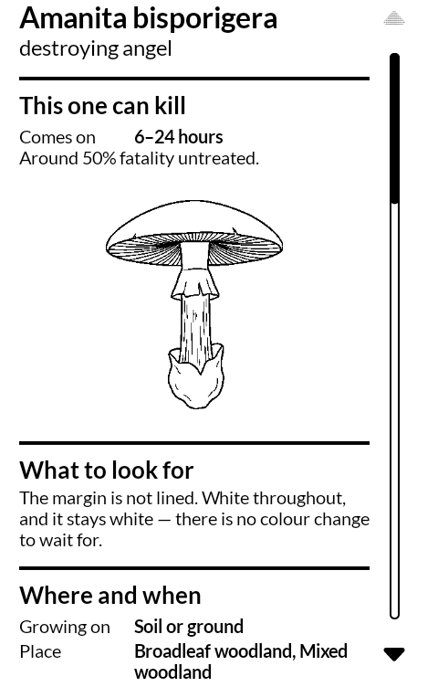

# 茸帳 kinokochō — Mushroom Journal

A mushroom field journal for the [Mudita Kompakt](https://mudita.com/products/kompakt/),
built for its E Ink screen.

Not a fork. Written from scratch in Kotlin and Jetpack Compose, using Mudita's own
[MMD](https://github.com/mudita/MMD) design system so it looks like the apps the phone
already ships with.

*Kinokochō* is 茸帳 — a mushroom notebook. The 帳 is the one in 手帳 (pocket notebook)
and 野帳 (a surveyor's field book): a plain book you fill by going places.

| | |
|---|---|
|  |  |
|  |  |

## What it is, and what it is not

**It does not tell you what a mushroom is, and it will never tell you whether one is
edible.** There is no edibility field anywhere in it, by design. A phone that answers that
question confidently is a phone that eventually kills someone.

What it does is let you *write a mushroom down properly* while you are standing over it,
and then help you work out what you are looking at once you get home.

- **In the field:** record the characters you can actually see — substrate, hymenophore,
  gills, cap, stipe, flesh — in any order and however few of them. Add a note. Take
  photographs into labelled slots. The candidate list narrows as you go, and is always
  presented as *not yet ruled out*, never as an answer.
- **At home:** review the entry on a real screen with the photographs in colour, add the
  spore print you set overnight, and see which unrecorded character would have narrowed
  things most — the part that trains the next walk.
- **Then ask someone:** send the find out as plain text and photographs through whatever
  the phone already has — a message, an email, a forum post. It goes as a description and
  a shortlist of what has *not* been ruled out, with what you looked at and could not say
  said plainly, because that is the first thing anybody experienced will ask.
- **And keep a copy:** the whole journal, photographs and all, written to a zip and handed
  wherever you want it, and read back in on the other side of a lost phone. The database
  holds notes that cannot be taken again — the mushroom is gone and the season is over —
  and a book that lives in exactly one place is a book with a date on it. Reading a copy
  back in only ever adds: an old backup onto a journal that has been used since keeps
  both.
- **And write down the answer:** when somebody tells you what it was, there is a line to
  put it on. That is the whole point of keeping the book.

## Why E Ink is the right screen for this

Colour is diagnostic in mushroom identification and E Ink cannot show it. That would be
fatal for an identification app — but this is a *recording* app. Colour matters when you
decide, and deciding happens at home, on a screen that has it. In the field what you want
is a notebook that lasts days on a charge, reads in direct sun, and does not have anything
else on it.

## Structure

The character schema is global; the taxon data is a swappable region pack. Southern
Appalachia is pack one.

Everything generated is generated: the drawings from `tools/make-art.py`, the pack from
the `tools/add-*.py` batches, the illustrator's brief from the pack itself. A file that
has to be kept in step by hand is a file that drifts, and a work order that has drifted
from the data is worse than none.

Two checks live outside the test suite because they need the network and depend on other
people's databases moving under them. Run both when the pack changes.

`tools/verify-names.py` records, for every name in the pack, which outside authority says
the mushroom exists — and `PackIntegrityTest` refuses any taxon missing from that record.
This is the one guard that matters most here. A fabricated species has a perfect shape:
correct Latin, real genus, real epithet, and every other test in the suite green. The only
thing that catches it is somebody outside this repository having heard of it. The network
stays in the tool, where a flaky lookup delays a change; the rule stays in the test, where
it always runs.

`tools/check-names.py` asks GBIF and iNaturalist whether every name exists. The tests can
see that a name is a well-formed binomial, that its id agrees with it, that its lookalikes
resolve — and all of that passes for a name that is well-formed, consistent, and not real.

`tools/check-seasons.py` asks how each taxon's research-grade records fall across the
year here, and reports months the pack leaves out. It only ever widens: a season a month
too narrow hides a mushroom that is out and takes any warning attached to it away, while
one a month too wide shows a mushroom in a month it may not be out — which the month page
already says of every row on it. `--write` applies the widenings.

## Also in it

- **A month view.** What is about now, split evenly between the ones people go looking for
  and the ones that hurt people — which are often out at the same time. Anything lethal is
  listed however rarely it turns up. "Sought after" means people look for it; it is not
  the app saying anything is safe.
- **A page per mushroom.** What it looks like, where and when, what it is confused with and
  how to tell them apart, and how what you recorded lines up against it. Reachable from a
  shortlist, from the month view, or by looking a name up in any month.
- **Measurements, age and condition.** Facts about the specimen rather than the species,
  so they are recorded rather than asked. Age earns its place: a ring or a veil that is
  missing from an old mushroom proves nothing, and the key stops ruling things out on it.
- **Publishing to iNaturalist**, one find at a time, from the bottom of that find's own
  page. It goes up with its photographs, the characters you recorded, and — the part an
  identifier actually wants — what you looked at and could not say, and the three
  characters that would have narrowed it most. The shortlist stays on the phone. What the
  community calls it comes back into the entry, kept apart from what you wrote down
  yourself, so the two can disagree. Coordinates are obscured by default; see
  [PRIVACY.md](PRIVACY.md), which is worth reading on what "obscured" does and does not
  mean.

## Installing it

The APK is on the [releases page](https://github.com/wanderwildwood/kinokocho/releases/latest).
It is signed, and it installs on the Kompakt without anything else on the phone.

```sh
# The fixed name always points at the newest release; the versioned one does not.
curl -LO https://github.com/wanderwildwood/kinokocho/releases/latest/download/kinokocho.apk
curl -LO https://github.com/wanderwildwood/kinokocho/releases/latest/download/kinokocho.apk.sha256
sha256sum -c kinokocho.apk.sha256
adb install kinokocho.apk
```

Or point [Obtainium](https://github.com/ImranR98/Obtainium) at this repository and let it
track releases. Choose `kinokocho.apk` rather than `kinokocho-v*.apk` when it asks which
one: the fixed name keeps working after the next release.

Every release is built by CI and its certificate is checked against
`d08ec862513896a11d962c283dfb7c004c4fbfff3382bba4aaea1411c2c5b6e7` before it is published,
so an APK that installs over a previous one is the same key and your journal survives the
upgrade. If Android refuses the install with a signature error, the file did not come from
here.

Android 12 (API 31) or newer. It asks for no accessibility service and reads no
notifications.

## Taking it into the field

It works with the radio off, and it is meant to. Nothing it does in the field needs the
network — the pack, the drawings and the key are all on the phone.

A few things worth knowing before the first walk:

- **Answer what you can see and leave the rest.** Not knowing is a real answer and the key
  treats it as one; it never eliminates a mushroom on a character you did not record.
- **Dig the base out.** A volva is underground, and it is the character that separates the
  deadly *Amanita* from nearly everything else. It is the single most useful thing you can
  do while standing over a mushroom.
- **Set the spore print before you sleep.** Cap gills-down on paper overnight. It settles
  more than any other character and it cannot be got in the field, which is why an entry
  says *spore print pending* until you add it.
- **Take the photographs anyway**, even when the shortlist is already short. Colour is what
  you will want at home, and it is the thing the screen cannot give you.
- **An out-of-season find is worth writing down precisely because it is one.** Seasons in
  the pack are a guide; fungi do not read calendars.

The shortlist is not an answer. When it is short enough to be worth somebody's time, send
the find to a person who can actually say — that is what it is for.

## Status

Working and in daily use, and not finished. A hundred and thirty-two taxa in the Southern
Appalachia pack across forty-one characters, a hundred and twenty-five pairs that get
confused for one another, a hundred and sixty-nine drawings of single characters and
thirty-two of whole mushrooms, and a key that reaches the right taxon in about four
questions when the answers are true.

Nothing in the pack has been checked by a mycologist. Every row says so on its own page.
Publishing to iNaturalist is the answer to that: it puts the find in front of people who
can say, which is the whole shape of this app — narrow it in the field, let a person
decide in colour, later.

The launcher mark is a drawing of a chanterelle by the author, traced rather than
imitated. The rest of the drawings are worked to the same hand — thin, few lines, no
solid black — which is written down at the top of `tools/make-art.py`.

## Building

```sh
./gradlew testDebugUnitTest
./gradlew assembleRelease
```

The release build is minified. It is worth actually running rather than only building:
R8 takes it from 32 MB to under 3, and a minified Android app is where the surprises
live. This one has no keep rules and needs none — see `app/proguard-rules.pro` for why.

Builds are signed with a keystore in `signing/`, which is gitignored. There is no
fallback: without it the build produces an *unsigned* APK, which will not install
anywhere. That is deliberate — a signing key committed to a public repo is not a signing
key, it is a formality, and a missing one should stop you rather than quietly hand you
something installable.

**The debug build takes the same key**, which this file used to deny. It matters: the
first install of any variant fixes the signer for good, so a debug build put on a phone is
not a throwaway — install one signed with the Android debug key and the real one will not
go over the top of it.

### The iNaturalist application id

Publishing needs an iNaturalist OAuth application, and its id is not in this repository.
Supply it at build time:

```sh
./gradlew assembleRelease -PinatClientId=<the id>
```

or put `inatClientId=<the id>` in `local.properties`, which is gitignored.

**A build without one has no publishing button at all** and cannot reach the network.
That is the intended state for anyone who is not the person the application is registered
to. A PKCE client id is not a secret — it is in every copy of the APK by necessity — but
it *is* an identity: everything posted with it is attributed to that application on
iNaturalist's records. A fork should be posting as itself, and the surest way to make
that happen is for the source to carry no id to inherit.

Registering one is at <https://www.inaturalist.org/oauth/applications>, and reaching that
page needs the **APP_OWNER** role, which iNaturalist staff grant on a written request and
expect to see some identifications behind. It is a wait rather than a form. Set the
redirect URI to `kinokocho://oauth`, exactly as it reads in `INatConfig`.

## Support

This is free software and it stays free; there is nothing here to buy. If you would like to
send something somewhere anyway, there are some llamas who go through a great deal of hay:
<https://hotspringsllamas.org/donate/>

## Licence

GPL-3.0-only. See [LICENSE](LICENSE).

Copyright (C) 2026 wander wildwood.
